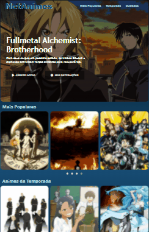
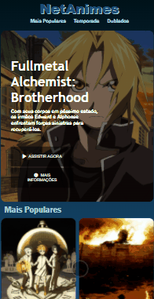
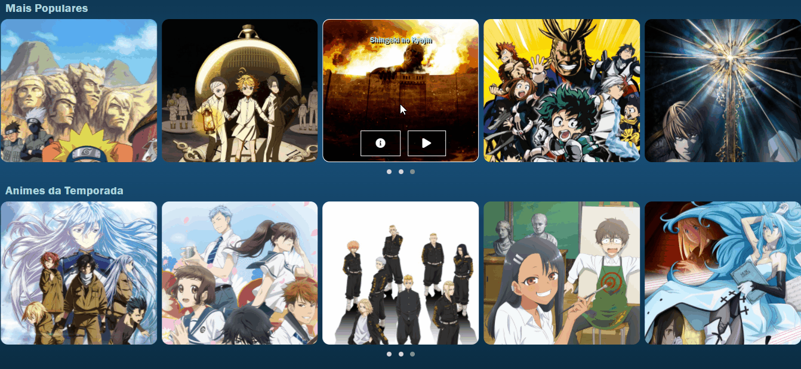

<h1 align="center">NetAnimes</h1>

Desafio proposto no Bootcamp HTML Web Developer da Digital Innovation One. 

Consistia em criar uma Interface de Streaming com base na aula de "Recriando a Interface do Netflix". 

Desenvolvido com a utilização de HTML, CSS, JavaScript e JQuery.

 

<h1>Funcionalidades</h1>
<nav>
    <li><a href="#Responsividade">Responsividade</a></li>
    <li><a href="#Carrossel">Carrosel</a></li>
    <li><a href="#Anime">Anime</a></li>
    <li><a href="#Desenvolvedor">Desenvolvedor</a></li>
</nav>

<h2 id="Responsividade">Responsividade</h2>
 
<li>Desktops</li>
 

  
<li>Tablets</li>
 

  
<li>Celulares</li>
 

 

 
<h2 id="Carrossel">Carrossel</h2>

Criados com base em categorias especificas.

 

 
<h2 id="Anime">Anime</h2>

Em cada Card, assim que se passa o mouse por cima é possível ver o nome da obra, e dois botões.

O botão de informações a esquerda ti redireciona para uma página do Anime no <a href="https://anilist.co/home">Anilist</a>, site de catalogação de Animes e Personagens.

A direita, o botão "play" o levará para um link do <a href="https://www.youtube.com/">YouTube</a> contendo a música de abertura do anime em questão.

 
<h2 id="Desenvolvedor">Desenvolvedor</h2>

Guilherme Manfrin Pereira

<a href="https://www.linkedin.com/in/guilherme-manfrin-pereira-4875a2207/">LinkedIn</a> | <a href="https://github.com/GuilhermeManfrin134">GitHub</a

